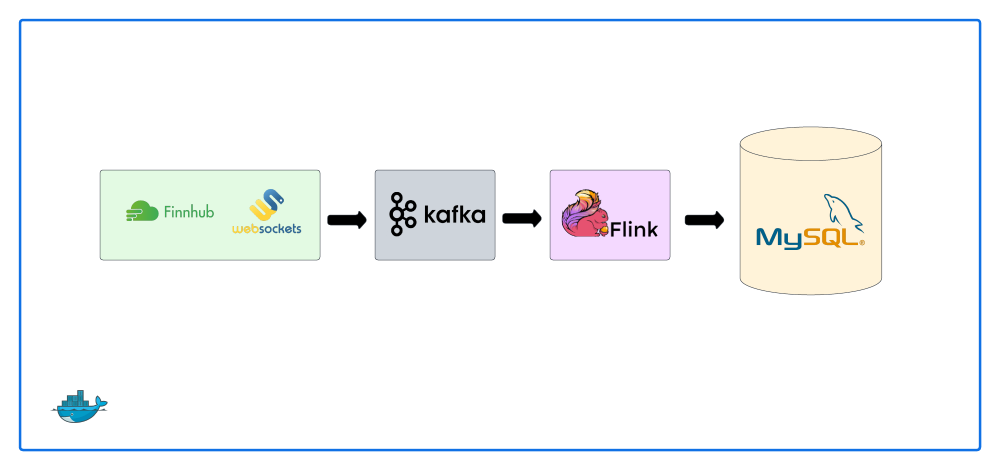

# Real-Time Cryptocurrency Price Data Pipeline
[](https://github.com/kanenorman/crypto-streaming/actions/workflows/unit-test.yaml)

## Overview

This project implements a real-time data pipeline for processing cryptocurrency price data. It uses a suite of technologies including Docker, Finnhub WebSockets, Kafka, Flink, and MySQL.

## Architecture

The pipeline is designed as follows:

- **Finnhub WebSockets**: Streams real-time cryptocurrency price data.
- **Kafka**: Acts as a messaging system that decouples the data ingestion from processing.
- **Flink**: Processes the streaming data and applies transformations.
- **MySQL**: Stores the processed data for further analysis or querying.



## Components

### `producer.py`

This Python script is responsible for establishing a connection to Finnhub via WebSockets. It ingests real-time cryptocurrency price data and then publishes it to a specified Kafka topic, ensuring that the data is ready for stream processing.

### `queries.sql`

This file contains a collection of Flink SQL queries. These queries are used for streaming the data from Kafka, performing necessary transformations, and ultimately publishing the processed data to a MySQL sink.

### `init.sql`

This SQL script is designed to set up the initial database schema in MySQL. It defines the structure of the tables and other database objects necessary for storing the cryptocurrency price data that has been processed by Flink.

## Setup and Configuration

### Prerequisites

- Docker
- Finnhub API Key

### Usage

1. Clone the repository to your local machine.
   ```
   git clone git@github.com:kanenorman/crypto-streaming.git
   ```
2. Ensure Docker is running
   ```
   $ sudo systemctl start docker
   ```
3. Create a `.env` file
   ```
   FINNHUB_API_KEY=<your-api-key>
   MYSQL_ROOT_USER=user
   MYSQL_ROOT_PASSWORD=password
   ```
4. Start the containers
   ```
   docker compose build && docker compose up -d
   ```

## License

This project is licensed under the [MIT License](LICENSE).

## Authors

- Kane Norman
